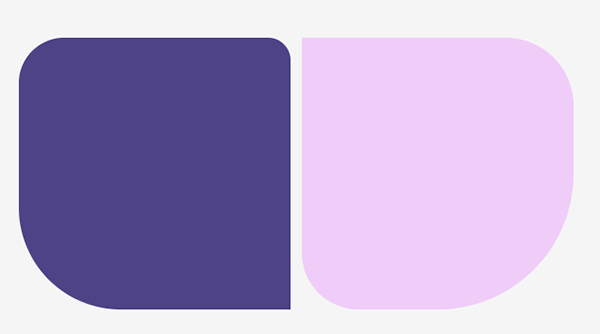

# Animar `background-color`
A partir de una lista de colores dada, crea una animación de colores aplicados a un elemento como se ve en la imagen


En este ejercicio aplicaremos:

- Acceso a listas
- Tratar valores con y sin comillas
- Animaciones

Lista de colores

```
$colours: '#ff0066', turquoise, blueviolet;
```

# Pasar lista como parámetro a un mixin
Dada una lista anidada, crea las figuras de la imagen pasándole a un mixin la lista que determina su forma



En este ejercicio aplicaremos:

- Creación de mixins
- Trabajar con listas

Lista anidada:

```
$squareList: 
    (1rem, 0.5rem, 2.25rem, 0),
    (0, 1.5rem, 1.25rem, 3rem);
```